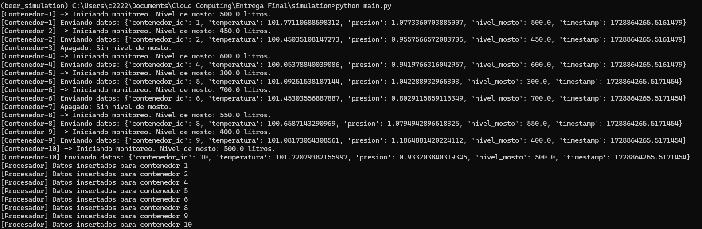
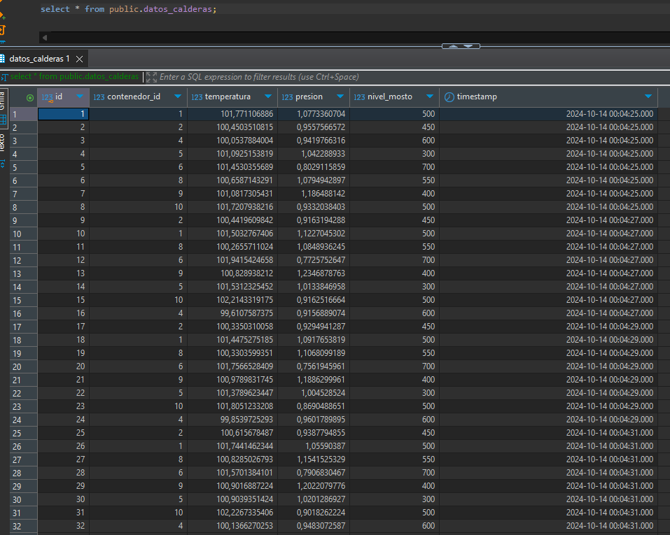

# Grupo 6. Caso de Uso: "Ingeniería Predictiva Ltda."


## Integrandes del Equipo

1. **Primer ítem**: Nini Yohana Ruiz Rodriguez.
2. **Segundo ítem**: Otto Ricardo Ramos Guaqueta.
3. **Tercer ítem**: Jonathan Campos Lozano.
4. **Cuarto ítem**: William Albeiro Amaya Patino. 

## Desarrollo

Este proyecto simula el monitoreo de contenedores de fermentación en un proceso de producción. Utiliza hilos para simular múltiples contenedores, cada uno de los cuales envía datos como temperatura, presión y nivel de mosto a un sistema de base de datos PostgreSQL.

## Requisitos

- Python 3.x
- Bibliotecas de Python:
  - `psycopg2`

Puedes instalar las bibliotecas requeridas usando pip:

```bash
pip install psycopg2
```

## Configuración de la Base de Datos

Antes de ejecutar el programa, asegúrate de tener una base de datos PostgreSQL configurada. Crea una tabla llamada `datos_calderas` con la siguiente estructura:

```sql
CREATE TABLE public.datos_calderas (
    contenedor_id INT,
    temperatura FLOAT,
    presion FLOAT,
    nivel_mosto FLOAT,
    timestamp TIMESTAMP
);
```

Ajusta la configuración de la base de datos en el archivo según sea necesario:

```python
DB_CONFIG = {
    'dbname': 'postgres',
    'user': 'beer_admin',
    'password': 'beer_pass',
    'host': 'localhost',
    'port': 5432
}
```

## Uso

Para ejecutar el programa, simplemente ejecuta el script Python:

```bash
python nombre_del_archivo.py
```

Por defecto, el script monitorea los contenedores durante 1 minuto. Puedes ajustar la duración modificando la variable `duracion_minutos` en el bloque `if __name__ == "__main__"`.

## Estructura del Código

### Clases

- **ContenedorFermentacion**: 
  - Hereda de `threading.Thread`.
  - Simula el monitoreo de un contenedor de fermentación.
  - Envía datos (temperatura, presión, nivel de mosto) a una cola de eventos.

### Funciones

- **get_db_connection()**: 
  - Establece una conexión a la base de datos PostgreSQL.

- **procesar_stream()**: 
  - Procesa los datos en la cola `data_stream` y los inserta en la base de datos.

- **iniciar_monitoreo_contenedores(contenedores_data, duracion_minutos)**: 
  - Inicia el monitoreo de los contenedores y el procesamiento de datos en hilos separados.

## Ejemplo de Datos

El script incluye datos de ejemplo para 10 contenedores con distintos niveles de mosto. Los contenedores vacíos no se activarán. La información de cada contenedor se imprime en la consola y se guarda en la base de datos.


```python
contenedores_data = {
    1: 500.0,  # Contenedor 1 con 500 litros
    2: 450.0,  # Contenedor 2 con 450 litros
    3: 0.0,    # Contenedor 3 vacío (estará apagado)
    4: 600.0,  # Contenedor 4 con 600 litros
    5: 300.0,  # Contenedor 5 con 300 litros
    6: 700.0,  # Contenedor 6 con 700 litros
    7: 0.0,    # Contenedor 7 vacío (estará apagado)
    8: 550.0,  # Contenedor 8 con 550 litros
    9: 400.0,  # Contenedor 9 con 400 litros
    10: 500.0  # Contenedor 10 con 500 litros
}
```



### Imagen Base de Datos



En esta imagen se recrea la carga de la informacion proveniente del `data_stream`. en la cual cada registro es un evento que se genera para la medicion del estado de la caldera.


